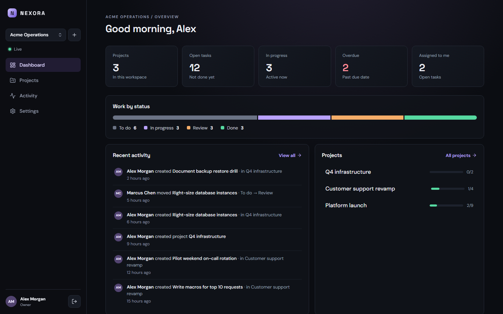
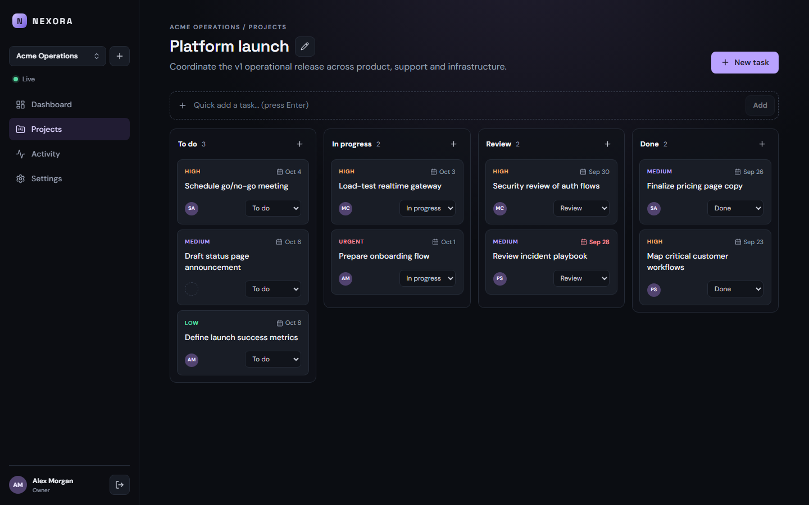
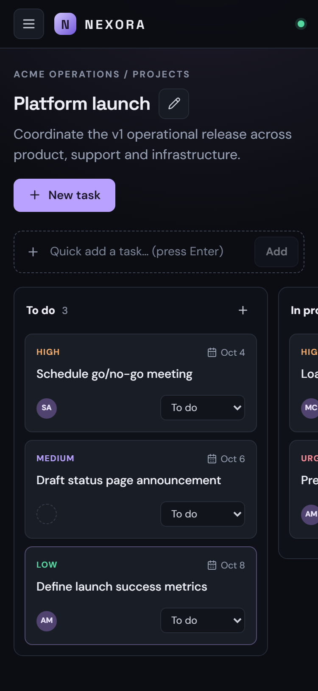

# Nexora

**Real-time operations platform for teams** — workspaces, projects and a live Kanban board with an activity feed, built as a pnpm monorepo (React + NestJS + PostgreSQL).



## Features

- **Accounts** — register / sign in with bcrypt-hashed passwords and short-lived JWT access tokens.
- **Workspaces** — multi-tenant isolation; owners rename the workspace and add teammates.
- **Projects** — create, edit and (owners only) delete projects, with per-status progress.
- **Kanban board** — create, edit, assign, prioritize, schedule, move and delete tasks; quick add; optimistic status moves.
- **Realtime** — every change is pushed over Socket.IO to teammates in the same workspace; no reloads, no duplicates.
- **Activity feed** — an audit-style log of workspace, member, project and task changes, paginated and live.
- **Dashboard** — workspace-wide metrics (open, in progress, overdue, assigned to me) and status distribution.
- **Accessible & responsive** — keyboard-operable, WCAG 2.1 AA automated audit in E2E, validated at 375 / 768 / 1024 / 1440 px.
- **OpenAPI** — interactive API docs at `/api/docs`.

| Board | Mobile |
| --- | --- |
|  |  |

## Architecture

```
Browser ──► React 18 + Vite (TanStack Router · TanStack Query · RHF + Zod)
              │ HTTP /api/v1           │ WebSocket /socket.io
              ▼                        ▼
            NestJS 10 (REST controllers · Socket.IO gateway)
              │ Prisma 6
              ▼
            PostgreSQL 16 (Docker Compose locally)
```

```
apps/
  api/        NestJS API — auth, workspaces, projects, tasks, activities, realtime, health
  web/        React SPA — routes, feature modules, UI primitives, Playwright E2E
packages/
  contracts/  Shared enums, form schemas, API response and realtime event types
docs/         Architecture, security model, API/realtime reference, ADRs, screenshots
```

More detail: [docs/architecture/overview.md](docs/architecture/overview.md) · [docs/security.md](docs/security.md) · [docs/api.md](docs/api.md) · [ADRs](docs/adr).

## Getting started

**Requirements:** Node.js ≥ 22, pnpm 9 (`corepack enable`), Docker.

```bash
pnpm install
pnpm db:up                                  # PostgreSQL on 127.0.0.1:5432 (waits until healthy)
cp apps/api/.env.example apps/api/.env      # then set JWT_SECRET (see below)
pnpm db:generate
pnpm db:migrate
pnpm db:seed                                # optional demo data (safe to re-run)
pnpm dev                                    # API :3000, web :5173
```

Generate a JWT secret for `apps/api/.env`:

```bash
node -e "console.log(require('crypto').randomBytes(48).toString('base64url'))"
```

Open http://localhost:5173. With the seed loaded, sign in as **demo@nexora.local / demo-password** (fictional demo account; teammates `priya@`, `marcus@`, `sofia@nexora.local` use the same password).

API docs: http://localhost:3000/api/docs · Health: http://localhost:3000/api/v1/health

## Commands

| Command | What it does |
| --- | --- |
| `pnpm dev` | API (watch) + web dev server with API/WebSocket proxy |
| `pnpm lint` | ESLint flat config (typescript-eslint recommended + React Hooks rules) — zero warnings allowed |
| `pnpm typecheck` | `tsc --noEmit` in every package |
| `pnpm test` | Contracts + web (Vitest/RTL) + API unit and integration tests (Jest + real PostgreSQL) |
| `pnpm test:e2e` | Playwright against the real stack on an isolated `nexora_e2e` database |
| `pnpm build` | Production builds (`apps/api/dist`, `apps/web/dist`) |
| `pnpm validate` | lint → typecheck → test → build |
| `pnpm db:up` / `db:down` | Start / stop the local PostgreSQL container |

API integration tests use the `nexora_test` database and E2E uses `nexora_e2e`; neither touches your development data. Both are created automatically on first run.

First E2E run: `pnpm --filter @nexora/web exec playwright install chromium`.

## Configuration

API (`apps/api/.env`, see [.env.example](apps/api/.env.example)):

| Variable | Required | Default | Notes |
| --- | --- | --- | --- |
| `DATABASE_URL` | yes | — | PostgreSQL URL. Use `127.0.0.1` locally. |
| `JWT_SECRET` | yes | — | ≥ 32 chars; known placeholders are rejected. **No fallback.** |
| `JWT_EXPIRES_IN` | no | `2h` | e.g. `15m`, `2h`, `1d` |
| `CORS_ORIGINS` | prod: yes | dev: `http://localhost:5173` | Comma-separated allow-list; `*` is rejected. Also applies to Socket.IO. |
| `PORT` | no | `3000` | |
| `SWAGGER_ENABLED` | no | on outside production | |
| `LOG_FORMAT` | no | `pretty` (`json` in production) | |
| `AUTH_RATE_LIMIT` | no | `10` | Login/register attempts per minute per client |

The API validates configuration at startup and exits with a readable error when it is invalid.

Web (`apps/web/.env`, optional): `VITE_API_URL` and `VITE_SOCKET_URL` for a separately hosted API. In development the Vite proxy is used.

## Troubleshooting

- **Port 3000 or 5432 already in use** — another local app may hold `127.0.0.1:3000` while the API binds `::`, so the
  web proxy silently talks to the wrong server. Run the API elsewhere: set `PORT=3001` in `apps/api/.env` and start the
  web app with `VITE_PROXY_TARGET=http://127.0.0.1:3001`.
- **`Can't reach database server at localhost:5432`** — use `127.0.0.1` in `DATABASE_URL`; `localhost` may resolve to
  IPv6 and reach a different listener.
- **API exits with `Invalid configuration`** — the message lists every missing/invalid variable (e.g. `JWT_SECRET`).

## Security

Tenant isolation is enforced server-side on every request (task → project → workspace → membership), assignees must belong to the task's workspace, realtime rooms require a membership check, and errors never expose stack traces. See [docs/security.md](docs/security.md). Please report vulnerabilities privately (see [SECURITY.md](SECURITY.md)).

## Project status

v0.2 — a hardened, tested foundation. Not deployed anywhere. Known limitations and next steps are tracked in [docs/reports/FINAL_ENGINEERING_REPORT.md](docs/reports/FINAL_ENGINEERING_REPORT.md).

## License

[MIT](LICENSE)
